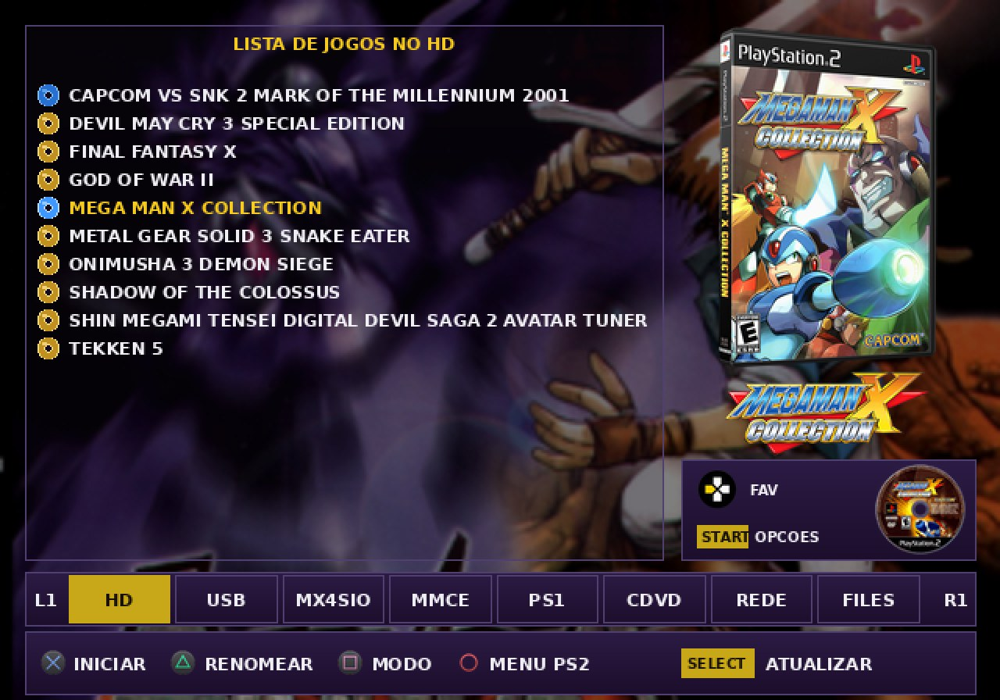
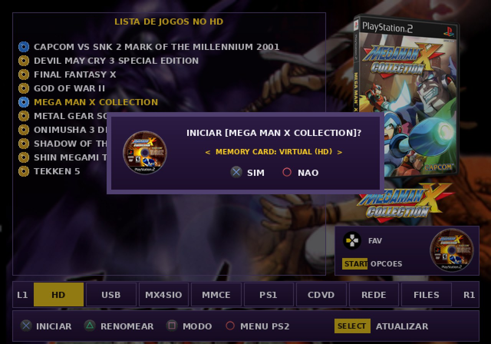
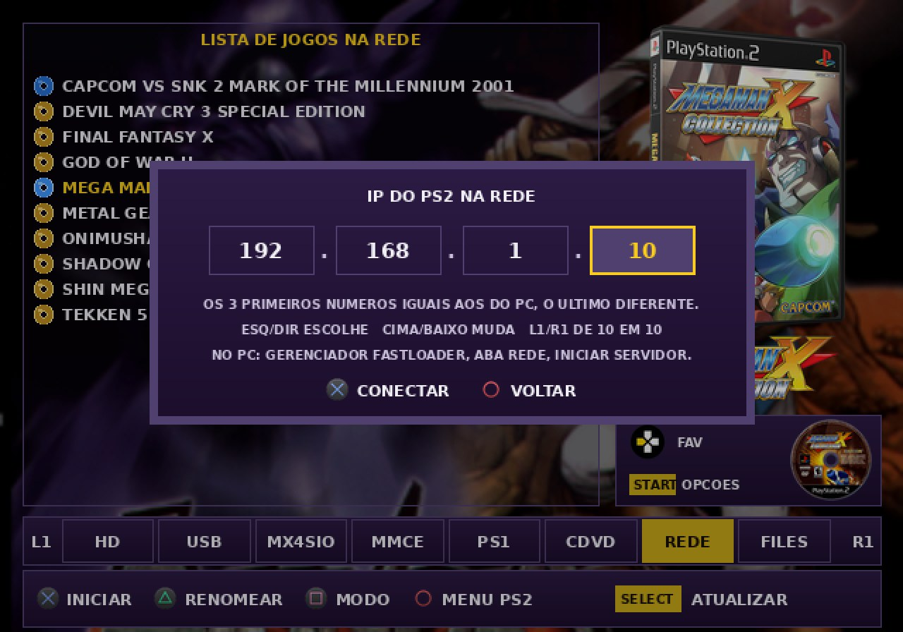
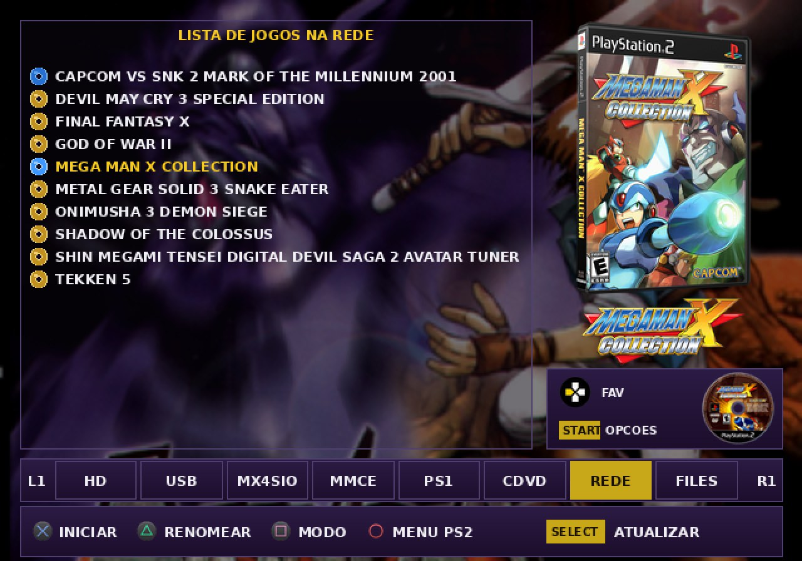
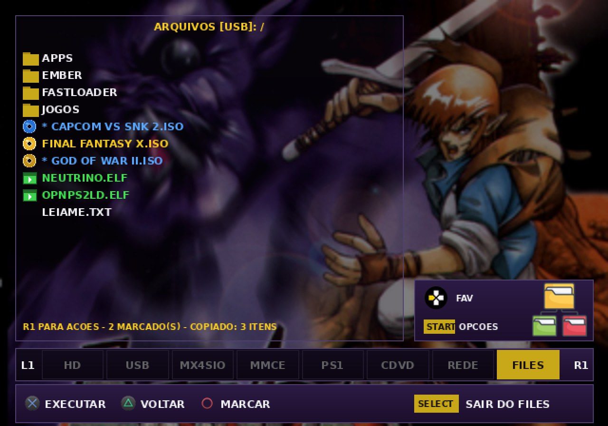
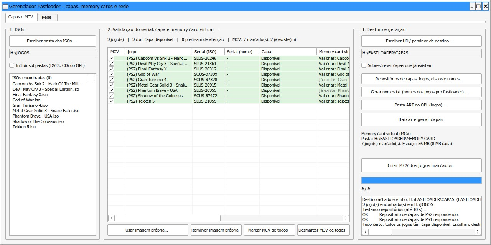
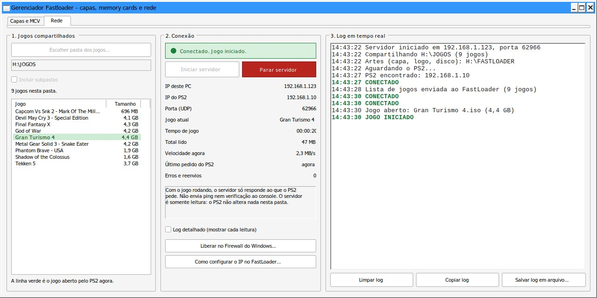

# FastLoader

**O loader de PS2 feito para TV de tubo.** Letra grande, capa de cada jogo na tela e um arquivo só para copiar.

Você conhece a cena: PS2 ligado na TV de tubo, lista de jogos em letra miúda, você levanta do sofá para conseguir ler. Depois descobre que a ISO tinha que estar numa pasta com nome certo, que a capa precisava de outro programa e que, para copiar um save, é preciso sair e abrir outro aplicativo.

O FastLoader nasceu para acabar com isso. Você liga, lê a lista de longe, vê a capa do jogo e aperta X.

**[Baixar a versão mais recente](https://github.com/Kyllemn/PS2TVCRT/releases)** · **[Abrir o manual ilustrado](https://claude.ai/artifact/TbHwMBFJQS6zcHkxzZPuug)**

<p align="center"></p>

Versão atual: **V2.0.8**. Antes este projeto se chamava RetroLoader.

---

## O que você ganha em um minuto de leitura

- **Lê de longe.** A interface foi desenhada para CRT. Não depende de tema, de skin nem de ajuste.
- **Um arquivo.** Imagens, ícones e fontes já estão dentro do `fastLoader.elf`. Nada de pastas soltas para o loader abrir.
- **ISO em qualquer pasta.** Ele procura sozinho até 4 níveis abaixo da raiz. `JOGOS/PS2/Luta/Tekken 5.iso` aparece na lista sem você configurar nada.
- **Oito lugares numa tela só.** HD interno, pendrive, MX4SIO, MMCE, jogos de PS1, disco no leitor, jogos do PC pela rede e um gerenciador de arquivos.
- **Seu save não depende mais do cartão.** Cada jogo pode ter o próprio memory card virtual, criado na hora, com um botão.
- **Jogue direto do PC.** Sem pendrive e sem HD no console: o jogo vem pelo cabo de rede, com capa e tudo.
- **Capas sem trabalho.** Um programa para Windows baixa capa, logo e disco de cada jogo e grava no lugar certo.

Se você usa HD em exFAT, pendrive ou cartão SD e quer ligar e jogar, continue lendo.

---

## Comece em 3 passos

1. Baixe o `fastLoader2.0.8.elf` nas [Releases](https://github.com/Kyllemn/PS2TVCRT/releases) e copie para o memory card ou pendrive.
2. Copie a pasta inteira do [Neutrino](https://github.com/rickgaiser/neutrino) para `FastLoader/` no pendrive, no HD ou no memory card.
3. Abra o `fastLoader2.0.8.elf` pelo seu launcher (FreeMcBoot, PS2BBL e outros), escolha a aba e aperte X.

Pronto. Suas ISOs já estão na lista, onde quer que estejam.

Quer que ele seja a primeira coisa que o console abre? Renomeie para `BOOT.ELF` e coloque no lugar do boot do seu PS2.

---

## Tudo o que ele faz

### Jogos de PS2

- Lista ISOs do **HD interno** (exFAT), do **pendrive** (exFAT ou FAT32), do **MX4SIO** e do **MMCE** (os dois slots juntos na mesma lista).
- Busca em **qualquer pasta**, até 4 níveis abaixo da raiz, com até 256 jogos por aba.
- **Ícone antes de cada nome**: CD azul para jogo com menos de 800 MB, DVD dourado para os maiores. O tipo vem do tamanho do arquivo, então a lista não fica mais lenta por isso.
- **Capa, logo e disco** do jogo selecionado, à direita da lista.
- **Confirmação antes de iniciar**, com o disco do jogo no popup. Acabou o boot por engano.
- **Modos de compatibilidade por jogo**: leitura rápida, leitura sincronizada, desvincular syscalls, emular DVD-DL e corrigir buffer overrun. Você marca uma vez e o loader lembra.
- **Voltar onde parou**: ao abrir, ele já vai para a aba e o jogo que você iniciou por último.
- **Pendrive plugado depois**: pode ligar o console só com o HD e plugar o pendrive mais tarde.
- **Barra de progresso de verdade** ao ler um dispositivo, em vez de uma tela parada.
- **MX4SIO e MMCE no mesmo console**: R3 troca de um para o outro sem reiniciar o loader.

### Memory card virtual

Um arquivo de 8 MB que o jogo enxerga como o memory card do slot 1.

- **Um cartão por jogo**, guardado junto dos jogos, em `FASTLOADER/MEMORY CARD/`.
- **Criado pelo próprio loader**: no popup de iniciar, escolha "CRIAR VIRTUAL" e aperte X. O cartão sai formatado e o jogo já inicia com ele.
- **Físico ou virtual, você escolhe** com esquerda e direita, antes de cada jogo. A escolha fica guardada.
- Funciona no HD, no pendrive e no MX4SIO. No HD grava rápido; no pendrive o jogo salva devagar e o loader avisa.
- O slot 2 continua sendo o cartão de verdade.

<p align="center"></p>

### Jogos pela rede

Recurso novo. A aba REDE lista e inicia os jogos que estão numa pasta do seu PC.

- **Sem compartilhar pasta no Windows, sem usuário e sem senha.** O programa Gerenciador Fastloader entrega os jogos.
- **Uma coisa só para configurar no console:** o IP do PS2, num quadro com quatro números. Ele fica guardado.
- **Capa, logo e disco também vêm pela rede.**
- **Você vê tudo acontecendo no PC:** quem conectou, qual jogo abriu, a velocidade e os erros, num log em tempo real.
- O servidor é somente leitura: o PS2 não altera nada no seu PC.
- Precisa de adaptador de rede no PS2 e do Neutrino v1.8.0 ou mais novo.

<table>
<tr>
<td></td>
<td></td>
</tr>
</table>

### Jogos de PS1

- Aba própria, usando o emulador [Ember](https://github.com/Gageformer/Ember).
- **Jogos com vários discos**: a lista mostra "(3 DISCOS)" e você escolhe qual iniciar.
- **Opções do Ember por jogo** antes de iniciar: controle, sombreamento, timing e dithering.
- Capa quadrada, logo e disco, como nos jogos de PS2.

### Disco no leitor

- A aba CDVD inicia o disco que está na gaveta: CD de PS1, CD de PS2 ou DVD de PS2.
- Mostra o **serial, o nome do jogo e a imagem do disco** antes de iniciar.

### Gerenciador de arquivos embutido

Você não precisa sair do loader para mexer nos seus arquivos.

- Abre **HD, pendrive, MX4SIO, MMCE e os dois memory cards**.
- **Copia, move e apaga vários itens de uma vez**, de qualquer dispositivo para qualquer outro. Pastas inteiras também.
- **Copie saves entre memory cards** ou guarde no pendrive.
- Renomear, criar pasta, marcar todos, inverter marcação e propriedades.
- **Renomear uma ISO leva tudo junto**: a capa, a logo, o disco, o memory card virtual, o favorito e os modos daquele jogo.
- Executa `.elf` e inicia `.iso` de qualquer pasta.
- Barra de progresso em MB, cancelamento a qualquer momento e resumo no fim.

<p align="center"></p>

### Favoritos, renomear e opções

- **Favoritos**: até 10 jogos, de qualquer dispositivo. Esquerda guarda, START+SELECT abre.
- **Renomear na tela**: troque o nome que aparece na lista, com um teclado na TV. O arquivo não muda.
- **Teclado completo**: maiúsculas, minúsculas e símbolos.
- **Opções**: desligar o console, reset e créditos, com a versão instalada.
- **Fundo diferente a cada vez** que o loader abre, sem repetir até passar por todos.

### Gerenciador Fastloader, para Windows

O programa que acompanha o loader. Não precisa instalar.

- Lê suas ISOs e **descobre o serial de cada jogo**.
- **Baixa capa, logo e disco** e grava no tamanho, no nome e na pasta que o loader usa.
- **Acha a pasta certa sozinho**: procura a `FASTLOADER` dentro da pasta dos jogos ou acima dela.
- **Cria os memory cards virtuais** de vários jogos de uma vez.
- **Serve os jogos pela rede**, com lista, situação da conexão e log.
- Aceita capa própria, cola imagem copiada do navegador e remove o fundo de logos e discos.
- Renomeia as ISOs em lote e guarda os nomes originais para desfazer.

<table>
<tr>
<td></td>
<td></td>
</tr>
</table>

---

## FastLoader e OPL, lado a lado

O OPL é um projeto excelente e maduro. O FastLoader não tenta fazer tudo o que ele faz: ele resolve outro problema, que é ligar o PS2 numa TV de tubo e jogar sem preparar nada. Compare e veja qual combina com o seu uso.

| | FastLoader | OPL oficial |
|---|---|---|
| Onde ficam as ISOs | Em qualquer pasta, até 4 níveis | Nas pastas `CD` e `DVD` |
| Jogos pela rede | Programa próprio no PC, sem configurar compartilhamento | Compartilhamento SMBv1 do Windows ou de um NAS |
| Gerenciador de arquivos | Embutido, entre 6 dispositivos | Não faz parte do OPL |
| Jogos de PS1 | Aba própria, com escolha de disco | Não faz parte do OPL |
| Capas | Programa próprio baixa e grava no lugar | Pasta `ART`, preenchida com ferramentas à parte |
| Memory card virtual | Criado pelo loader no popup de iniciar | Tem, configurado por jogo |
| Aparência | Uma interface, feita para CRT | Definida por temas |

**Onde o OPL continua sendo a escolha certa:** HD no formato APA/PFS, trapaças, controles USB e Bluetooth (PADEMU), GSM, iLink e voltar ao menu pelo controle durante o jogo. O FastLoader não tem nada disso.

Os dois podem conviver no mesmo console. Experimente sem apagar nada.

---

## Controles

### Listas de jogos

| Botão | Ação |
|---|---|
| **X** | Carrega a lista na primeira vez. Depois, pergunta e inicia o jogo |
| **Triângulo** | Renomeia o nome exibido |
| **Quadrado** | Modos de compatibilidade do jogo |
| **Círculo** | Sai para o menu do PS2, com confirmação |
| **Cima / Baixo** | Navega. Segurando, a lista rola sozinha |
| **Esquerda** | Adiciona aos favoritos |
| **L1 / R1** | Aba anterior e próxima |
| **L2 / R2** | Página anterior e próxima |
| **SELECT** | Atualiza a lista. Na aba REDE, reabre o IP do PS2 |
| **START** | Opções: desligar, reset e créditos |
| **START + SELECT** | Abre os favoritos |
| **R3** | Nas abas MX4SIO e MMCE, troca entre os dois |

### No popup de iniciar

| Botão | Ação |
|---|---|
| **Esquerda / Direita** | Troca o memory card entre físico e virtual |
| **X** | Inicia |
| **Círculo** | Volta para a lista |

### No gerenciador de arquivos (FILES)

| Botão | Ação |
|---|---|
| **X** | Entra na pasta. Em `.elf` ou `.iso`, pergunta e executa |
| **Triângulo** | Volta uma pasta |
| **Círculo** | Marca ou desmarca o item |
| **Esquerda / Direita** | Pula 10 itens |
| **R1** | Menu: Recortar, Copiar, Colar, Excluir, Renomear, Nova pasta, Marcar todos, Desmarcar todos, Inverter marcação, Propriedades e Limpar copiados |
| **SELECT** | Sai do FILES |

### Nos outros popups

| Tela | Botões |
|---|---|
| Favoritos | **X** inicia, **Triângulo** remove, **Círculo** fecha |
| Modos de compatibilidade | **X** marca, **Triângulo** salva, **Círculo** cancela |
| Jogo de PS1 | **X** troca o valor ou o disco, **Triângulo** inicia, **Círculo** volta |
| IP da rede | **Esquerda / Direita** escolhem o campo, **Cima / Baixo** mudam o número, **L1 / R1** de 10 em 10, **X** conecta |
| Teclado | **X** digita, **Quadrado** troca maiúsculas e minúsculas, **L1 / R1** movem o cursor |

Todos os detalhes, com as telas, estão no [manual ilustrado](https://claude.ai/artifact/TbHwMBFJQS6zcHkxzZPuug).

---

## Instalação completa

### O que é obrigatório

| Pasta | Para quê | Onde colocar |
|---|---|---|
| **Neutrino** | Inicia os jogos de PS2 | `FastLoader/` no pendrive, no HD ou no memory card do slot 1. A pasta inteira: `neutrino.elf`, `config/` e `modules/` |
| **Ember** | Roda os jogos de PS1 | `EMBER/` na raiz do HD ou do pendrive, com o `ember.elf`, a BIOS do seu próprio console e uma pasta por jogo em `EMBER/games/` |

Use sempre a versão mais nova do Neutrino e troque a pasta inteira de uma vez. O loader procura o Neutrino no pendrive, depois no HD e por último no memory card. Se não achar, ele avisa.

### Estrutura de pastas

```
DISPOSITIVO:/
├── Jogo.iso                          ISOs na raiz ou em qualquer pasta,
├── JOGOS/PS2/Luta/Tekken 5.iso       até 4 níveis abaixo da raiz
├── FastLoader/                       Neutrino: neutrino.elf + config/ + modules/
├── EMBER/
│   ├── ember.elf
│   ├── bios.bin
│   └── games/
│       └── Final Fantasy VII/        um jogo por pasta, todos os discos juntos
└── FASTLOADER/                       criada pelo Gerenciador Fastloader
    ├── nomes.txt
    ├── MEMORY CARD/                  memory cards virtuais
    └── CAPAS/
        ├── PS2/                      NOME.PNG, NOME_LOGO.PNG, NOME_ICO.PNG
        └── PS1/
```

No memory card do slot 1 ficam os seus ajustes: favoritos, nomes trocados, modos de cada jogo, escolha de memory card, último jogo e IP da rede.

### Para jogar pela rede

1. No PC, abra o `GerenciadorFastloader.exe`, vá na aba Rede e escolha a pasta dos jogos.
2. Clique em "Liberar no Firewall do Windows..." na primeira vez e depois em "Iniciar servidor".
3. No PS2, vá na aba REDE, aperte X e acerte o IP: os três primeiros números iguais aos do PC, o último diferente.
4. Aperte X de novo. A lista de jogos do PC aparece.

---

## O que você precisa saber antes

- **HD interno**: só em exFAT. HD no formato APA/PFS não é lido.
- **Pendrive em FAT32** não guarda arquivo de 4 GB ou mais. Para DVD grande, use exFAT.
- **Compatibilidade de jogos**: é a do Neutrino. Se um jogo não abrir, teste os modos com o Quadrado.
- **PS1**: precisa do Ember Beta 2 ou mais novo para a escolha de disco. A aba PS1 lê HD e pendrive.
- **Rede**: o jogo salva no memory card de verdade. O PC precisa ficar ligado, com o servidor rodando, enquanto você joga.
- **Não há volta ao loader pelo controle** durante o jogo. Para sair, reinicie o console.
- Este projeto não distribui jogos, BIOS nem arquivos da Sony.

---

## Perguntas rápidas

**Preciso formatar ou reorganizar meus jogos?**
Não. Se as ISOs estão em exFAT ou FAT32, em qualquer pasta, elas aparecem.

**Preciso apagar o OPL?**
Não. O FastLoader é um arquivo a mais. Abra quando quiser.

**As capas são obrigatórias?**
Não. Sem capa o loader funciona igual. Com capa fica mais bonito, e o Gerenciador Fastloader faz o trabalho.

**Como sei qual versão tenho?**
START, Créditos. A linha mostra a versão e a data.

**Onde tiro dúvidas de uma tela específica?**
No [manual ilustrado](https://claude.ai/artifact/TbHwMBFJQS6zcHkxzZPuug). Ele tem todas as telas, todos os avisos e os limites.

---

## Novidades

| Versão | O que entrou |
|---|---|
| **V2.0.8** | Programa de Windows com nome novo: Gerenciador Fastloader. Título da aba REDE corrigido |
| **V2.0.7** | Pendrive plugado depois do HD. Barra de progresso ao atualizar a lista. Barras mais finas |
| **V2.0.6** | Aba REDE: jogos do PC pelo cabo de rede, com capa |
| **V2.0.5** | Memory card virtual criado pelo loader. Renomear uma ISO leva tudo junto |
| **V2.0.4** | Memory card virtual por jogo. Voltar onde parou. Nova ordem das abas. Versão nos Créditos |
| Builds 12 a 18 | Jogos de PS1 com vários discos, gerenciador de arquivos completo, memory cards no FILES, ícones de CD e DVD, ISOs em qualquer pasta |

---

## Baixe e teste

O download leva um minuto e não mexe em nada do que você já tem no console.

**[Ir para as Releases](https://github.com/Kyllemn/PS2TVCRT/releases)**

Arquivos: `fastLoader2.0.8.elf` para o PS2 e `GerenciadorFastloader.exe` para o Windows.

---

## Notas

- O código-fonte deste projeto é fechado. Apenas as versões compiladas são publicadas aqui, pelas Releases.
- O [Neutrino](https://github.com/rickgaiser/neutrino) e o [Ember](https://github.com/Gageformer/Ember) são projetos independentes. Consulte os repositórios deles para detalhes e créditos.
- Equipe Retrovolt · Leonardo Torres
